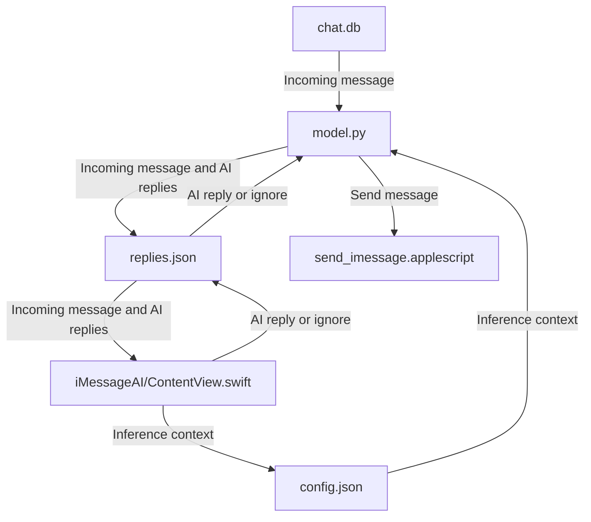

# iMessageAI

As a full-time researcher and student, I often work in long, uninterrupted stretches. Friends, family, and loved ones message me, but I frequently forget to respond or reply hours later. This is a real personal bottleneck. Since iMessage is deeply integrated into macOS, building an AI assistant that monitors messages, surfaces replies, and generates mood-aligned drafts directly improves my daily communication without breaking focus.

---

# iMessageAI — AI-Powered iMessage Auto-Replier

**iMessageAI** is a macOS tool that monitors incoming iMessages, analyzes them, and generates multiple suggested replies using a customizable personality and mood system. The suggestions are powered by a local LLM (Llama 3.1 8B through Ollama) and can be quickly sent through the app.

---

```
iMessageAI/
├── model.py                      # Core engine: chat.db watcher + System Prompt + LLM calls + JSON parsing
├── send_imessage.applescript     # Send message script
├── config.json                   # Personality + moods config
├── replies.json                  # Holds possible text responses and communication signals between Swift/Python
├── problemstatement.txt          # Project problem statement
├── iMessageAI.xcodeproj          # Swift app
├── iMessageAI.app                # Built by Xcode
├── iMessageAI/                   # SwiftUI source files
├── iMessageAI.pdf                # Write up
├── iMessageAI.mp4                # Demo video (Git LFS)
└── README.md
```


## SETUP
```
cd ~/
git clone git@github.com:cadenroberts/iMessageAI.git
cd iMessageAI
brew install ollama
open iMessageAI.xcodeproj
```

In XCode, you can run the app and see the output and logic flow of model.py. To generate the app yourself, go to Product -> Archive -> Distribute App -> Custom -> Copy App

Once you have your app you can pin it to your dock and open it there or simply do:

```
open iMessageAI.app
```

## ARCHITECTURE


